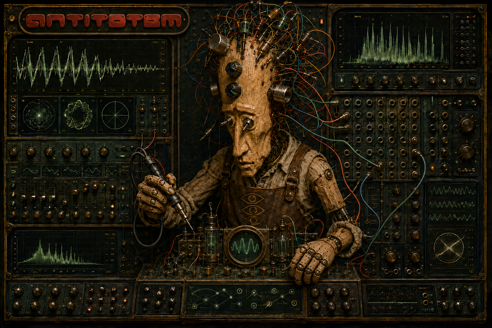
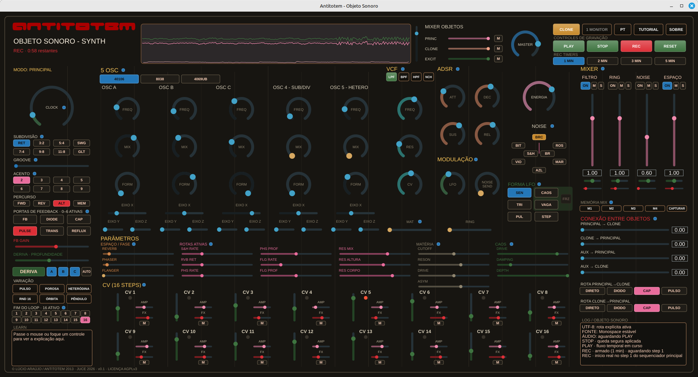

# Antitotem




Contact: **rasgo.instruments@gmail.com**

Languages:

- [English](#english)
- [Português](#português)
- [Français](#français)
- [Español](#español)

---

## English

**Status:** runnable prototype / ongoing investigation
**Authorship:** Lúcio Araújo
**Origin:** authorial hardware instrument, modular, CMOS/discrete, 2013
**Version:** v0.1 · **License:** AGPLv3 (see [`LICENSE`](LICENSE) and
[`CREDITS_AND_SOURCES.md`](CREDITS_AND_SOURCES.md))

Technical research: [CMOS 4000 series and Lunetta practice](docs/PESQUISA_CMOS_LUNETTA.md).
**Relation to RASGO:** precursor and patron; remains its own work.

This directory does not replace or move Antitotem's historical archive. It
gathers the current digital prototype and the documentation of an
investigation inspired by the instrument's material practice.

### Run it

On a system with CMake, a C++20 compiler, JUCE and an audio device:

```bash
./run_antitotem.sh
```

Downloads: [**Antitotem v0.1.0** release](https://github.com/lucioaraujo/antitotem/releases/tag/v0.1.0)
— Linux `.deb`, Windows `.exe` (NSIS) and macOS `.dmg` (DragNDrop), all
built via CI on GitHub's own hosted runners. The Linux package has been
installed and opened on real hardware; Windows/macOS build cleanly but
have not been opened on real hardware yet. See
[`INSTALL.md`](INSTALL.md) for requirements, package installation and
troubleshooting (EN/PT), and [`docs/TAREFAS.md`](docs/TAREFAS.md) for the
full plan and current status.

The application is a standalone JUCE/C++ instrument: five oscillators, a
16-step scanner, ADSR, multimode VCF, noise and S&H, feedback sends,
effects, mixer, a permanent L/R oscilloscope, memory drift and up to five
minutes of stereo WAV recording. The panel includes a compact log of
compositional actions and recording state.

Authorial memories guiding the current investigation are in
[`docs/MEMORIAL_DE_PROCESSO.md`](docs/MEMORIAL_DE_PROCESSO.md); schematics,
photographs and measurements remain material evidence to be checked before
any factual reconstruction.

See also the [listening tutorials](docs/TUTORIAIS.md) and the open-items
list in [`docs/TAREFAS.md`](docs/TAREFAS.md).

### Future ideas (not implemented)

Everything below is a direction to explore later, separate from the JUCE
app above — none of it is built yet:

- **[Antitotem Breadboard Lab](docs/IDEIA_BREADBOARD.md)** — an
  educational/performative instrument on a virtual breadboard, where the
  person assembles modules by connecting chips and components instead of a
  ready-made panel. A separate project, not a revision of the current
  Antitotem.
- **3D interface**, **simplified web version** and other explorations —
  see [`docs/TAREFAS.md`](docs/TAREFAS.md).

### Archive and origin image

The **SDIY RASGO Breadboard Prototype Synth** photograph belongs to Lúcio
Araújo's personal archive — see
[`docs/IDEIA_BREADBOARD.md`](docs/IDEIA_BREADBOARD.md) for the planned
future use context.

Current institutional references:

- [Instrument strategy](../RASGO_DOCUMENTATION/architecture/ESTRATEGIA_INSTRUMENTOS.md)
- [Archive catalog](../RASGO_DOCUMENTATION/arquivo/CATALOGO_DE_ACERVOS.md)
- [Master panel](../RASGO_DOCUMENTATION/PAINEL_MESTRE.md)

---

## Português

**Estado:** protótipo executável / investigação em curso
**Autoria:** Lúcio Araújo
**Origem:** instrumento de hardware autoral, modular, CMOS/discreto, 2013
**Versão:** v0.1 · **Licença:** AGPLv3 (ver [`LICENSE`](LICENSE) e
[`CREDITS_AND_SOURCES.md`](CREDITS_AND_SOURCES.md))

Pesquisa técnica: [CMOS 4000 e práticas Lunetta](docs/PESQUISA_CMOS_LUNETTA.md).
**Relação com RASGO:** precursor e patrono; permanece uma obra própria.

Este diretório não substitui nem move o acervo histórico do Antitotem. Ele
reúne o protótipo digital atual e a documentação de uma investigação inspirada
pela prática material do instrumento.

### Executar

Em um sistema com CMake, compilador C++20, JUCE e dispositivo de áudio:

```bash
./run_antitotem.sh
```

Downloads: [**release Antitotem v0.1.0**](https://github.com/lucioaraujo/antitotem/releases/tag/v0.1.0)
— `.deb` Linux, `.exe` Windows (NSIS) e `.dmg` macOS (DragNDrop), todos
gerados via CI nos runners hospedados pelo próprio GitHub. O pacote Linux
já foi instalado e aberto de verdade; Windows/macOS compilam limpos mas
ainda não foram abertos em hardware real. Ver
[`INSTALL.md`](INSTALL.md) para requisitos, instalação do pacote e
solução de problemas (EN/PT), e [`docs/TAREFAS.md`](docs/TAREFAS.md) para
o plano completo e o estado atual.

O aplicativo é um instrumento standalone JUCE/C++: cinco osciladores, scanner
de 16 etapas, ADSR, VCF multimodo, ruídos e S&H, retornos, efeitos, mixer,
osciloscópio L/R permanente, deriva de memória e gravação WAV estéreo de até
cinco minutos. O painel inclui um log compacto das ações composicionais e do
estado de registro.

Memórias de autoria que orientam a investigação atual ficam em
[`docs/MEMORIAL_DE_PROCESSO.md`](docs/MEMORIAL_DE_PROCESSO.md); esquemas,
fotografias e medições continuam sendo evidências materiais a confrontar antes
de qualquer reconstrução factual.

Consulte também os [Tutoriais de escuta](docs/TUTORIAIS.md) e a lista do que
falta em [`docs/TAREFAS.md`](docs/TAREFAS.md).

### Ideias futuras (não implementadas)

Tudo abaixo é registro de direção a explorar depois, separado do app JUCE
acima — nada disto está construído ainda:

- **[Antitotem Breadboard Lab](docs/IDEIA_BREADBOARD.md)** — instrumento
  educativo/performático numa breadboard virtual, onde a pessoa monta módulos
  conectando chips e componentes, em vez de um painel pronto. Projeto
  separado, não uma revisão do Antitotem atual.
- **Interface 3D**, **versão web simplificada** e demais explorações — ver
  [`docs/TAREFAS.md`](docs/TAREFAS.md).

### Acervo e imagem de origem

A fotografia do **SDIY RASGO Breadboard Prototype Synth** pertence ao arquivo
pessoal de Lúcio Araújo — ver [`docs/IDEIA_BREADBOARD.md`](docs/IDEIA_BREADBOARD.md)
para o contexto de uso futuro planejado.

Referências institucionais atuais:

- [Estratégia dos instrumentos](../RASGO_DOCUMENTATION/architecture/ESTRATEGIA_INSTRUMENTOS.md)
- [Catálogo do acervo](../RASGO_DOCUMENTATION/arquivo/CATALOGO_DE_ACERVOS.md)
- [Painel mestre](../RASGO_DOCUMENTATION/PAINEL_MESTRE.md)

---

## Français

**État :** prototype exécutable / recherche en cours
**Auctorialité :** Lúcio Araújo
**Origine :** instrument matériel auctorial, modulaire, CMOS/discret, 2013
**Version :** v0.1 · **Licence :** AGPLv3 (voir [`LICENSE`](LICENSE) et
[`CREDITS_AND_SOURCES.md`](CREDITS_AND_SOURCES.md))

Recherche technique : [série CMOS 4000 et pratique Lunetta](docs/PESQUISA_CMOS_LUNETTA.md).
**Relation avec RASGO :** précurseur et parrain ; reste une œuvre à part
entière.

Ce répertoire ne remplace ni ne déplace le fonds historique d'Antitotem.
Il réunit le prototype numérique actuel et la documentation d'une
recherche inspirée par la pratique matérielle de l'instrument.

### Exécuter

Sur un système avec CMake, un compilateur C++20, JUCE et un périphérique
audio :

```bash
./run_antitotem.sh
```

Téléchargements : [**release Antitotem v0.1.0**](https://github.com/lucioaraujo/antitotem/releases/tag/v0.1.0)
— `.deb` Linux, `.exe` Windows (NSIS) et `.dmg` macOS (DragNDrop), tous
générés via CI sur les runners hébergés par GitHub lui-même. Le paquet
Linux a été installé et ouvert pour de vrai ; Windows/macOS compilent
proprement mais n'ont pas encore été ouverts sur du matériel réel.
Voir [`INSTALL.md`](INSTALL.md) pour les prérequis, l'installation
du paquet et le dépannage (EN/PT), et [`docs/TAREFAS.md`](docs/TAREFAS.md)
pour le plan complet et l'état actuel.

L'application est un instrument autonome JUCE/C++ : cinq oscillateurs, un
scanner 16 pas, ADSR, VCF multimode, bruits et S&H, retours, effets,
mixeur, un oscilloscope L/R permanent, une dérive de mémoire et un
enregistrement WAV stéréo jusqu'à cinq minutes. Le panneau inclut un
journal compact des actions compositionnelles et de l'état
d'enregistrement.

Les mémoires auctoriales qui orientent la recherche actuelle sont dans
[`docs/MEMORIAL_DE_PROCESSO.md`](docs/MEMORIAL_DE_PROCESSO.md) ; schémas,
photographies et mesures restent des preuves matérielles à confronter
avant toute reconstruction factuelle.

Voir aussi les [tutoriels d'écoute](docs/TUTORIAIS.md) et la liste des
tâches ouvertes dans [`docs/TAREFAS.md`](docs/TAREFAS.md).

### Idées futures (non implémentées)

Tout ce qui suit est une direction à explorer plus tard, séparée de
l'application JUCE ci-dessus — rien de tout cela n'est encore construit :

- **[Antitotem Breadboard Lab](docs/IDEIA_BREADBOARD.md)** — un
  instrument éducatif/performatif sur une breadboard virtuelle, où la
  personne assemble des modules en connectant puces et composants plutôt
  qu'un panneau tout fait. Un projet séparé, pas une révision de
  l'Antitotem actuel.
- **Interface 3D**, **version web simplifiée** et autres explorations —
  voir [`docs/TAREFAS.md`](docs/TAREFAS.md).

### Fonds et image d'origine

La photographie du **SDIY RASGO Breadboard Prototype Synth** appartient
aux archives personnelles de Lúcio Araújo — voir
[`docs/IDEIA_BREADBOARD.md`](docs/IDEIA_BREADBOARD.md) pour le contexte
d'usage futur prévu.

Références institutionnelles actuelles :

- [Stratégie des instruments](../RASGO_DOCUMENTATION/architecture/ESTRATEGIA_INSTRUMENTOS.md)
- [Catalogue du fonds](../RASGO_DOCUMENTATION/arquivo/CATALOGO_DE_ACERVOS.md)
- [Panneau maître](../RASGO_DOCUMENTATION/PAINEL_MESTRE.md)

---

## Español

**Estado:** prototipo ejecutable / investigación en curso
**Autoría:** Lúcio Araújo
**Origen:** instrumento de hardware autoral, modular, CMOS/discreto, 2013
**Versión:** v0.1 · **Licencia:** AGPLv3 (ver [`LICENSE`](LICENSE) y
[`CREDITS_AND_SOURCES.md`](CREDITS_AND_SOURCES.md))

Investigación técnica: [serie CMOS 4000 y práctica Lunetta](docs/PESQUISA_CMOS_LUNETTA.md).
**Relación con RASGO:** precursor y patrono; sigue siendo una obra propia.

Este directorio no sustituye ni traslada el acervo histórico de Antitotem.
Reúne el prototipo digital actual y la documentación de una investigación
inspirada en la práctica material del instrumento.

### Ejecutar

En un sistema con CMake, compilador C++20, JUCE y dispositivo de audio:

```bash
./run_antitotem.sh
```

Descargas: [**release Antitotem v0.1.0**](https://github.com/lucioaraujo/antitotem/releases/tag/v0.1.0)
— `.deb` Linux, `.exe` Windows (NSIS) y `.dmg` macOS (DragNDrop), todos
generados vía CI en los runners alojados por el propio GitHub. El paquete
Linux ya fue instalado y abierto de verdad; Windows/macOS compilan limpio
pero todavía no fueron abiertos en hardware real.
Ver [`INSTALL.md`](INSTALL.md) para requisitos, instalación del
paquete y solución de problemas (EN/PT), y
[`docs/TAREFAS.md`](docs/TAREFAS.md) para el plan completo y el estado
actual.

La aplicación es un instrumento independiente JUCE/C++: cinco osciladores,
un escáner de 16 pasos, ADSR, VCF multimodo, ruidos y S&H, retornos,
efectos, mezclador, un osciloscopio L/R permanente, deriva de memoria y
grabación WAV estéreo de hasta cinco minutos. El panel incluye un registro
compacto de las acciones composicionales y del estado de grabación.

Las memorias autorales que orientan la investigación actual están en
[`docs/MEMORIAL_DE_PROCESSO.md`](docs/MEMORIAL_DE_PROCESSO.md); esquemas,
fotografías y mediciones siguen siendo evidencia material a confrontar
antes de cualquier reconstrucción factual.

Ver también los [tutoriales de escucha](docs/TUTORIAIS.md) y la lista de
pendientes en [`docs/TAREFAS.md`](docs/TAREFAS.md).

### Ideas futuras (no implementadas)

Todo lo siguiente es una dirección a explorar más adelante, separada de
la app JUCE de arriba — nada de esto está construido todavía:

- **[Antitotem Breadboard Lab](docs/IDEIA_BREADBOARD.md)** — un
  instrumento educativo/performático en una breadboard virtual, donde la
  persona arma módulos conectando chips y componentes en vez de un panel
  ya hecho. Un proyecto separado, no una revisión del Antitotem actual.
- **Interfaz 3D**, **versión web simplificada** y demás exploraciones —
  ver [`docs/TAREFAS.md`](docs/TAREFAS.md).

### Acervo e imagen de origen

La fotografía del **SDIY RASGO Breadboard Prototype Synth** pertenece al
archivo personal de Lúcio Araújo — ver
[`docs/IDEIA_BREADBOARD.md`](docs/IDEIA_BREADBOARD.md) para el contexto de
uso futuro planeado.

Referencias institucionales actuales:

- [Estrategia de los instrumentos](../RASGO_DOCUMENTATION/architecture/ESTRATEGIA_INSTRUMENTOS.md)
- [Catálogo del acervo](../RASGO_DOCUMENTATION/arquivo/CATALOGO_DE_ACERVOS.md)
- [Panel maestro](../RASGO_DOCUMENTATION/PAINEL_MESTRE.md)
