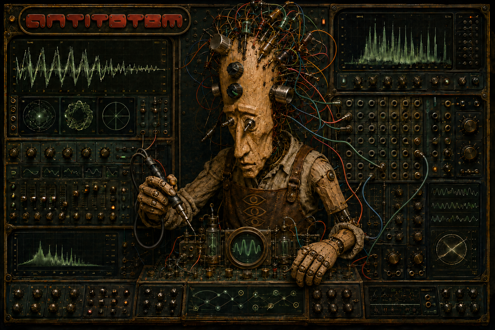
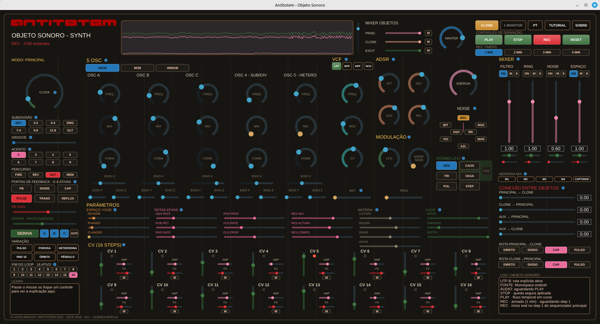

# Antitotem




Contact: **rasgo.instruments@gmail.com**

Languages:

- [English](#english)
- [Português](#português)
- [Français](#français)
- [Español](#español)

---

## English

**Status:** runnable prototype / ongoing investigation
**Authorship:** Lúcio Araújo
**Origin:** authorial hardware instrument, modular, CMOS/discrete, 2013
**Version:** v0.1 · **License:** AGPLv3 (see [`LICENSE`](LICENSE) and
[`CREDITS_AND_SOURCES.md`](CREDITS_AND_SOURCES.md))

Technical research: [CMOS 4000 series and Lunetta practice](docs/PESQUISA_CMOS_LUNETTA.md).
**Relation to RASGO:** precursor and patron; remains its own work.

This directory does not replace or move Antitotem's historical archive. It
gathers the current digital prototype and the documentation of an
investigation inspired by the instrument's material practice.

### Run it

On a system with CMake, a C++20 compiler, JUCE and an audio device:

```bash
./run_antitotem.sh
```

Downloads: [**Antitotem v0.1.3** release](https://github.com/lucioaraujo/antitotem/releases/tag/v0.1.3)
— Linux `.deb`, AppImage and `.tar.gz`; Windows installer `.exe` and
portable `.zip`; macOS Universal 2 `.dmg`. All are built by CI, which also
checks that the Windows `.exe` needs no Visual C++ runtime, that every
installer shortcut points to an installed file, that the macOS app is
sealed, and that the Linux packages open on Debian 12, Ubuntu 24.04, Fedora
and Arch. On real hardware it has been opened on Linux, installed on a Windows 10
(8 GB), and installed and opened on a Mac on 7 Oct. 2026 (after allowing
it — see INSTALL). See
[`INSTALL.md`](INSTALL.md) for step-by-step installation and requirements
(EN/PT), and [`docs/TAREFAS.md`](docs/TAREFAS.md) for the full plan and
current status.

The application is a standalone JUCE/C++ instrument: five oscillators, a
16-step scanner, ADSR, multimode VCF, noise and S&H, feedback sends,
effects, mixer, a permanent L/R oscilloscope, memory drift and up to five
minutes of stereo WAV recording. The panel includes a compact log of
compositional actions and recording state.

Authorial memories guiding the current investigation are in
[`docs/MEMORIAL_DE_PROCESSO.md`](docs/MEMORIAL_DE_PROCESSO.md); schematics,
photographs and measurements remain material evidence to be checked before
any factual reconstruction.

See also the [listening tutorials](docs/TUTORIAIS.md) and the open-items
list in [`docs/TAREFAS.md`](docs/TAREFAS.md).

### Future ideas (not implemented)

Everything below is a direction to explore later, separate from the JUCE
app above — none of it is built yet:

- **[Antitotem Breadboard Lab](docs/IDEIA_BREADBOARD.md)** — an
  educational/performative instrument on a virtual breadboard, where the
  person assembles modules by connecting chips and components instead of a
  ready-made panel. A separate project, not a revision of the current
  Antitotem.
- **3D interface**, **simplified web version** and other explorations —
  see [`docs/TAREFAS.md`](docs/TAREFAS.md).

### Archive and origin image

The **SDIY RASGO Breadboard Prototype Synth** photograph belongs to Lúcio
Araújo's personal archive — see
[`docs/IDEIA_BREADBOARD.md`](docs/IDEIA_BREADBOARD.md) for the planned
future use context.

Antitotem is part of the RASGO family of instruments:
[rasgoinstruments.arquiviagem.net](https://rasgoinstruments.arquiviagem.net/) · website:
[lucioaraujo.github.io/antitotem](https://lucioaraujo.github.io/antitotem/).

---

## Português

**Estado:** protótipo executável / investigação em curso
**Autoria:** Lúcio Araújo
**Origem:** instrumento de hardware autoral, modular, CMOS/discreto, 2013
**Versão:** v0.1 · **Licença:** AGPLv3 (ver [`LICENSE`](LICENSE) e
[`CREDITS_AND_SOURCES.md`](CREDITS_AND_SOURCES.md))

Pesquisa técnica: [CMOS 4000 e práticas Lunetta](docs/PESQUISA_CMOS_LUNETTA.md).
**Relação com RASGO:** precursor e patrono; permanece uma obra própria.

Este diretório não substitui nem move o acervo histórico do Antitotem. Ele
reúne o protótipo digital atual e a documentação de uma investigação inspirada
pela prática material do instrumento.

### Executar

Em um sistema com CMake, compilador C++20, JUCE e dispositivo de áudio:

```bash
./run_antitotem.sh
```

Downloads: [**release Antitotem v0.1.3**](https://github.com/lucioaraujo/antitotem/releases/tag/v0.1.3)
— Linux `.deb`, AppImage e `.tar.gz`; instalador `.exe` e `.zip` portátil
para Windows; `.dmg` Universal 2 para macOS. Tudo é gerado pela CI, que
também confere que o `.exe` do Windows não depende do runtime do Visual C++,
que cada atalho do instalador aponta para um arquivo instalado, que o app
do macOS está selado e que os pacotes Linux abrem em Debian 12, Ubuntu
24.04, Fedora e Arch. Em máquina real, ele já foi aberto no Linux,
instalado num Windows 10 (8 GB) e instalado e aberto num Mac em 7 out. 2026
(depois de liberado — ver INSTALL). Ver [`INSTALL.md`](INSTALL.md) para a instalação passo a passo e os
requisitos (EN/PT), e [`docs/TAREFAS.md`](docs/TAREFAS.md) para o plano
completo e o estado atual.

O aplicativo é um instrumento standalone JUCE/C++: cinco osciladores, scanner
de 16 etapas, ADSR, VCF multimodo, ruídos e S&H, retornos, efeitos, mixer,
osciloscópio L/R permanente, deriva de memória e gravação WAV estéreo de até
cinco minutos. O painel inclui um log compacto das ações composicionais e do
estado de registro.

Memórias de autoria que orientam a investigação atual ficam em
[`docs/MEMORIAL_DE_PROCESSO.md`](docs/MEMORIAL_DE_PROCESSO.md); esquemas,
fotografias e medições continuam sendo evidências materiais a confrontar antes
de qualquer reconstrução factual.

Consulte também os [Tutoriais de escuta](docs/TUTORIAIS.md) e a lista do que
falta em [`docs/TAREFAS.md`](docs/TAREFAS.md).

### Ideias futuras (não implementadas)

Tudo abaixo é registro de direção a explorar depois, separado do app JUCE
acima — nada disto está construído ainda:

- **[Antitotem Breadboard Lab](docs/IDEIA_BREADBOARD.md)** — instrumento
  educativo/performático numa breadboard virtual, onde a pessoa monta módulos
  conectando chips e componentes, em vez de um painel pronto. Projeto
  separado, não uma revisão do Antitotem atual.
- **Interface 3D**, **versão web simplificada** e demais explorações — ver
  [`docs/TAREFAS.md`](docs/TAREFAS.md).

### Acervo e imagem de origem

A fotografia do **SDIY RASGO Breadboard Prototype Synth** pertence ao arquivo
pessoal de Lúcio Araújo — ver [`docs/IDEIA_BREADBOARD.md`](docs/IDEIA_BREADBOARD.md)
para o contexto de uso futuro planejado.

O Antitotem faz parte da família de instrumentos RASGO:
[rasgoinstruments.arquiviagem.net](https://rasgoinstruments.arquiviagem.net/) · site:
[lucioaraujo.github.io/antitotem](https://lucioaraujo.github.io/antitotem/).

---

## Français

**État :** prototype exécutable / recherche en cours
**Auctorialité :** Lúcio Araújo
**Origine :** instrument matériel auctorial, modulaire, CMOS/discret, 2013
**Version :** v0.1 · **Licence :** AGPLv3 (voir [`LICENSE`](LICENSE) et
[`CREDITS_AND_SOURCES.md`](CREDITS_AND_SOURCES.md))

Recherche technique : [série CMOS 4000 et pratique Lunetta](docs/PESQUISA_CMOS_LUNETTA.md).
**Relation avec RASGO :** précurseur et parrain ; reste une œuvre à part
entière.

Ce répertoire ne remplace ni ne déplace le fonds historique d'Antitotem.
Il réunit le prototype numérique actuel et la documentation d'une
recherche inspirée par la pratique matérielle de l'instrument.

### Exécuter

Sur un système avec CMake, un compilateur C++20, JUCE et un périphérique
audio :

```bash
./run_antitotem.sh
```

Téléchargements : [**release Antitotem v0.1.3**](https://github.com/lucioaraujo/antitotem/releases/tag/v0.1.3)
— Linux `.deb`, AppImage et `.tar.gz` ; installeur `.exe` et `.zip`
portable pour Windows ; `.dmg` Universal 2 pour macOS. Tout est produit par
la CI, qui vérifie aussi que le `.exe` Windows ne dépend pas du runtime
Visual C++, que chaque raccourci de l'installeur pointe vers un fichier
installé, que l'app macOS est scellée et que les paquets Linux s'ouvrent sur
Debian 12, Ubuntu 24.04, Fedora et Arch. Sur machine réelle, il a été ouvert
sous Linux, installé sur un Windows 10 (8 Go), puis installé et ouvert sur
un Mac le 7 oct. 2026 (après l'avoir autorisé — voir INSTALL). Voir [`INSTALL.md`](INSTALL.md) pour
l'installation pas à pas et les prérequis (EN/PT), et
[`docs/TAREFAS.md`](docs/TAREFAS.md) pour le plan complet et l'état actuel.

L'application est un instrument autonome JUCE/C++ : cinq oscillateurs, un
scanner 16 pas, ADSR, VCF multimode, bruits et S&H, retours, effets,
mixeur, un oscilloscope L/R permanent, une dérive de mémoire et un
enregistrement WAV stéréo jusqu'à cinq minutes. Le panneau inclut un
journal compact des actions compositionnelles et de l'état
d'enregistrement.

Les mémoires auctoriales qui orientent la recherche actuelle sont dans
[`docs/MEMORIAL_DE_PROCESSO.md`](docs/MEMORIAL_DE_PROCESSO.md) ; schémas,
photographies et mesures restent des preuves matérielles à confronter
avant toute reconstruction factuelle.

Voir aussi les [tutoriels d'écoute](docs/TUTORIAIS.md) et la liste des
tâches ouvertes dans [`docs/TAREFAS.md`](docs/TAREFAS.md).

### Idées futures (non implémentées)

Tout ce qui suit est une direction à explorer plus tard, séparée de
l'application JUCE ci-dessus — rien de tout cela n'est encore construit :

- **[Antitotem Breadboard Lab](docs/IDEIA_BREADBOARD.md)** — un
  instrument éducatif/performatif sur une breadboard virtuelle, où la
  personne assemble des modules en connectant puces et composants plutôt
  qu'un panneau tout fait. Un projet séparé, pas une révision de
  l'Antitotem actuel.
- **Interface 3D**, **version web simplifiée** et autres explorations —
  voir [`docs/TAREFAS.md`](docs/TAREFAS.md).

### Fonds et image d'origine

La photographie du **SDIY RASGO Breadboard Prototype Synth** appartient
aux archives personnelles de Lúcio Araújo — voir
[`docs/IDEIA_BREADBOARD.md`](docs/IDEIA_BREADBOARD.md) pour le contexte
d'usage futur prévu.

Antitotem fait partie de la famille d'instruments RASGO :
[rasgoinstruments.arquiviagem.net](https://rasgoinstruments.arquiviagem.net/) · site :
[lucioaraujo.github.io/antitotem](https://lucioaraujo.github.io/antitotem/).

---

## Español

**Estado:** prototipo ejecutable / investigación en curso
**Autoría:** Lúcio Araújo
**Origen:** instrumento de hardware autoral, modular, CMOS/discreto, 2013
**Versión:** v0.1 · **Licencia:** AGPLv3 (ver [`LICENSE`](LICENSE) y
[`CREDITS_AND_SOURCES.md`](CREDITS_AND_SOURCES.md))

Investigación técnica: [serie CMOS 4000 y práctica Lunetta](docs/PESQUISA_CMOS_LUNETTA.md).
**Relación con RASGO:** precursor y patrono; sigue siendo una obra propia.

Este directorio no sustituye ni traslada el acervo histórico de Antitotem.
Reúne el prototipo digital actual y la documentación de una investigación
inspirada en la práctica material del instrumento.

### Ejecutar

En un sistema con CMake, compilador C++20, JUCE y dispositivo de audio:

```bash
./run_antitotem.sh
```

Descargas: [**release Antitotem v0.1.3**](https://github.com/lucioaraujo/antitotem/releases/tag/v0.1.3)
— Linux `.deb`, AppImage y `.tar.gz`; instalador `.exe` y `.zip` portátil
para Windows; `.dmg` Universal 2 para macOS. Todo lo genera la CI, que
además comprueba que el `.exe` de Windows no depende del runtime de Visual
C++, que cada acceso directo del instalador apunta a un archivo instalado,
que la app de macOS está sellada y que los paquetes Linux abren en Debian
12, Ubuntu 24.04, Fedora y Arch. En máquina real, ya se abrió en Linux, se
instaló en un Windows 10 (8 GB) y se instaló y abrió en un Mac el 7 oct.
2026 (tras autorizarlo — ver INSTALL).
Ver [`INSTALL.md`](INSTALL.md) para la instalación paso a paso y los
requisitos (EN/PT), y [`docs/TAREFAS.md`](docs/TAREFAS.md) para el plan
completo y el estado actual.

La aplicación es un instrumento independiente JUCE/C++: cinco osciladores,
un escáner de 16 pasos, ADSR, VCF multimodo, ruidos y S&H, retornos,
efectos, mezclador, un osciloscopio L/R permanente, deriva de memoria y
grabación WAV estéreo de hasta cinco minutos. El panel incluye un registro
compacto de las acciones composicionales y del estado de grabación.

Las memorias autorales que orientan la investigación actual están en
[`docs/MEMORIAL_DE_PROCESSO.md`](docs/MEMORIAL_DE_PROCESSO.md); esquemas,
fotografías y mediciones siguen siendo evidencia material a confrontar
antes de cualquier reconstrucción factual.

Ver también los [tutoriales de escucha](docs/TUTORIAIS.md) y la lista de
pendientes en [`docs/TAREFAS.md`](docs/TAREFAS.md).

### Ideas futuras (no implementadas)

Todo lo siguiente es una dirección a explorar más adelante, separada de
la app JUCE de arriba — nada de esto está construido todavía:

- **[Antitotem Breadboard Lab](docs/IDEIA_BREADBOARD.md)** — un
  instrumento educativo/performático en una breadboard virtual, donde la
  persona arma módulos conectando chips y componentes en vez de un panel
  ya hecho. Un proyecto separado, no una revisión del Antitotem actual.
- **Interfaz 3D**, **versión web simplificada** y demás exploraciones —
  ver [`docs/TAREFAS.md`](docs/TAREFAS.md).

### Acervo e imagen de origen

La fotografía del **SDIY RASGO Breadboard Prototype Synth** pertenece al
archivo personal de Lúcio Araújo — ver
[`docs/IDEIA_BREADBOARD.md`](docs/IDEIA_BREADBOARD.md) para el contexto de
uso futuro planeado.

Antitotem forma parte de la familia de instrumentos RASGO:
[rasgoinstruments.arquiviagem.net](https://rasgoinstruments.arquiviagem.net/) · sitio:
[lucioaraujo.github.io/antitotem](https://lucioaraujo.github.io/antitotem/).
